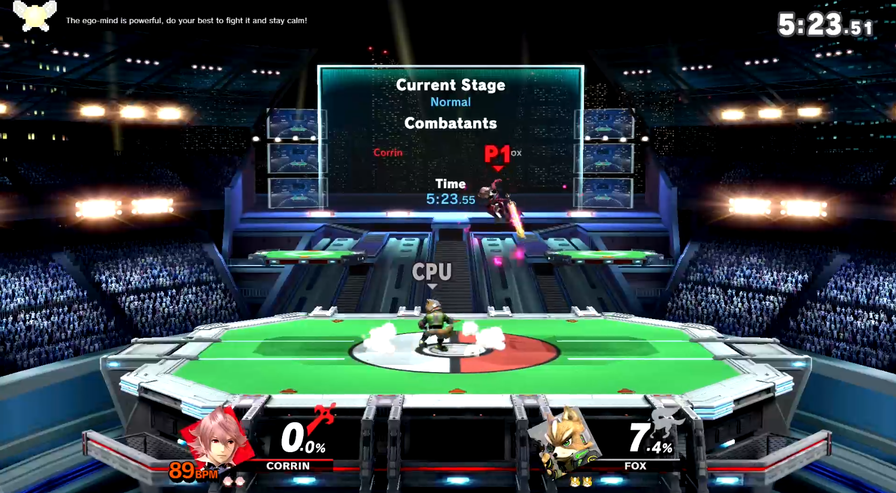
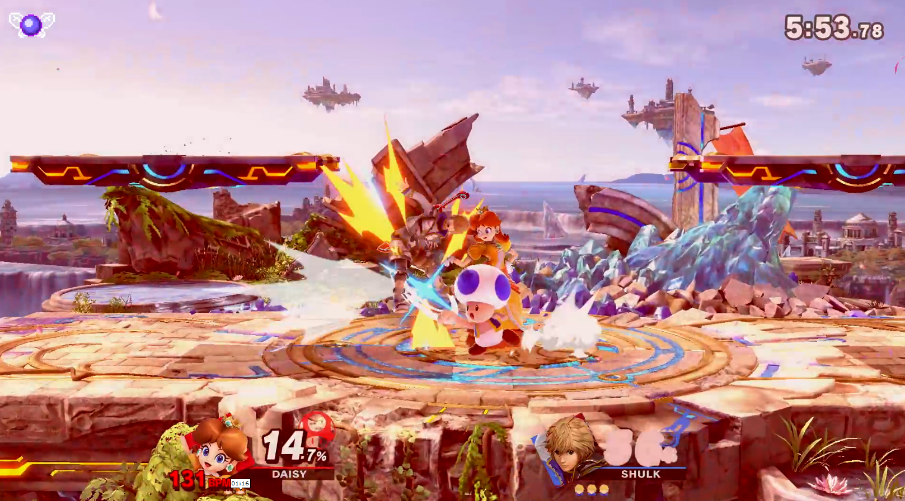
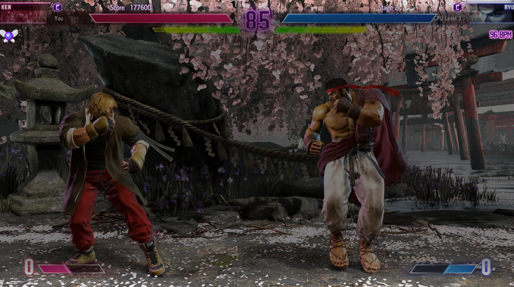
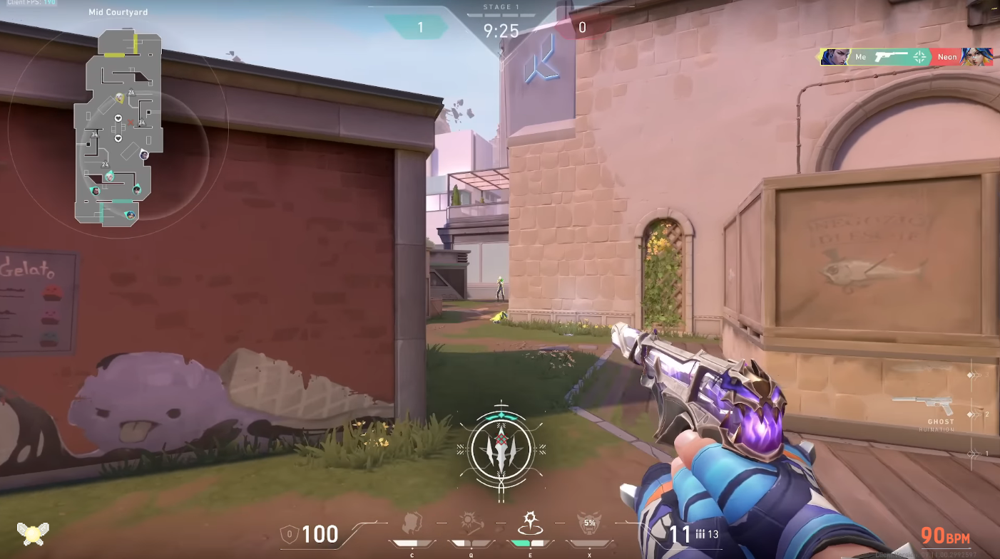

# Blossom
 An open source game overlay project that visualises your two selves within the mind and notifies/motivates you of your Self 1 taking over when your heart rate is high, via a heart rate sensor.

